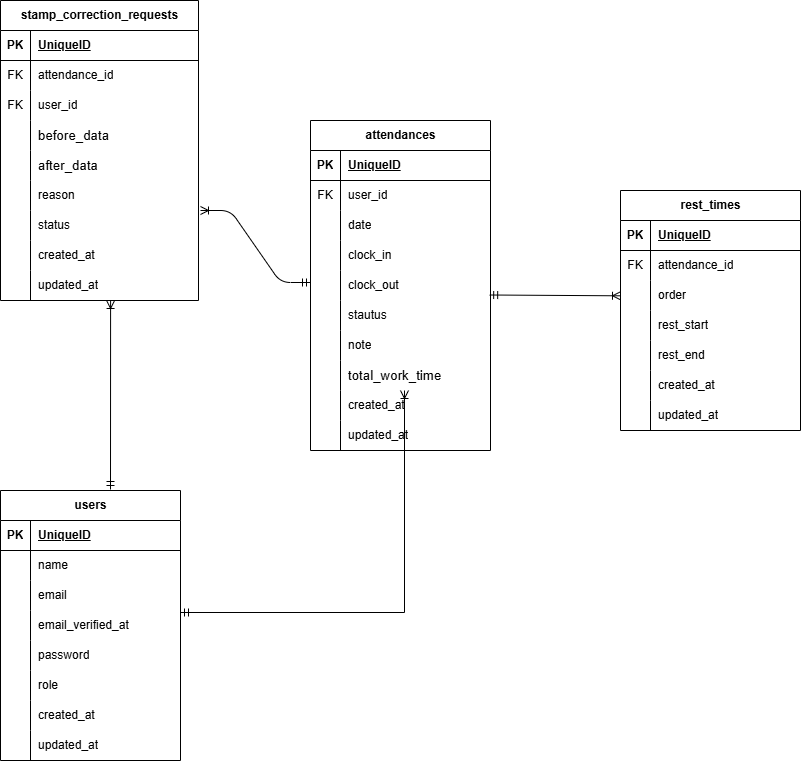

# attendance-management

## 環境構築

### Docker ビルド

1. リポジトリをクローン
   `git@github.com:Meg0317/attendance-management.git`
2. Docker Desktop を起動
3. コンテナをビルド・起動
   `docker-compose up -d --build`

---

### Laravel 環境構築

1. PHPコンテナに入る
   `docker-compose exec php bash`
2. パッケージインストール
   `composer install`
3. `.env` ファイルを作成
4. `.env` に以下を設定

DB_CONNECTION=mysql
DB_HOST=mysql
DB_PORT=3306
DB_DATABASE=laravel_db
DB_USERNAME=laravel_user
DB_PASSWORD=laravel_pass

5. アプリケーションキーの作成
   `php artisan key:generate`

6. マイグレーションの実行
   `php artisan migrate`

7. シーディングの実行
   `php artisan db:seed`

## 環境構築(クローン)

**Docker ビルド**

1. クローンを作成する
2. `git@github.com:Meg0317/attendance-management.git`
3. DockerDesktop アプリを立ち上げる
4. `docker-compose up -d --build`

**Laravel 環境構築(クローン)**

1. `docker-compose exec php bash`
2. `composer install`
3. 新しく.env ファイルを作成し環境変数を変更
4. .env に以下の環境変数を追加

```text
   DB_CONNECTION=mysql
   DB_HOST=mysql
   DB_PORT=3306
   DB_DATABASE=laravel_db
   DB_USERNAME=laravel_user
   DB_PASSWORD=laravel_pass
```

5. アプリケーションキーの作成

```bash
php artisan key:generate
```

6. マイグレーションの実行

```bash
php artisan migrate
```

7. シーディングの実行

```bash
php artisan db:seed
```

## 使用技術(実行環境)

- PHP 7.4.9 (fpm)
- Laravel 8.83.8
- MySQL 8.0.26
- Docker / Docker Compos

## ER 図



## URL

- 開発環境：http://localhost/
- phpMyAdmin:：http://localhost:8080/
- mailhog：http://localhost:8025

## 補足仕様

### 認証について

- 一定時間操作がない場合、再ログインが必要です
- 検証用として **user1 のみメール認証済み** となっています

---

### 勤怠詳細画面のURL設計について

本アプリでは、**打刻データが存在しない日でも勤怠の登録・修正が行える仕様**としています。
そのため、勤怠詳細画面は **attendance_id を基準とせず、日付（date）を基準** に表示する設計としています。

#### 一般ユーザー

- 勤怠詳細画面
  `GET /attendance/detail/{date}`

#### 管理者

- 勤怠詳細画面
  `GET /admin/attendance/{user}/{date}`

---

### 勤怠の登録・修正処理について

勤怠の登録および修正は、**IDを指定せず日付ベースで処理**されます。

- 一般ユーザー
  `POST /attendance/detail`

- 管理者
  `POST /admin/attendance`
